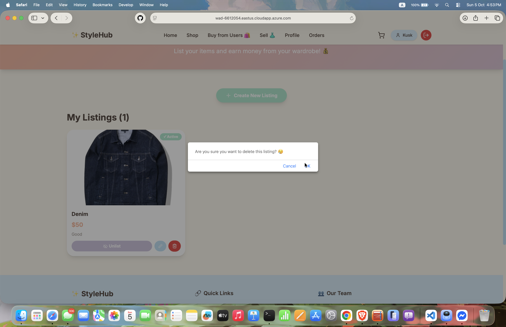
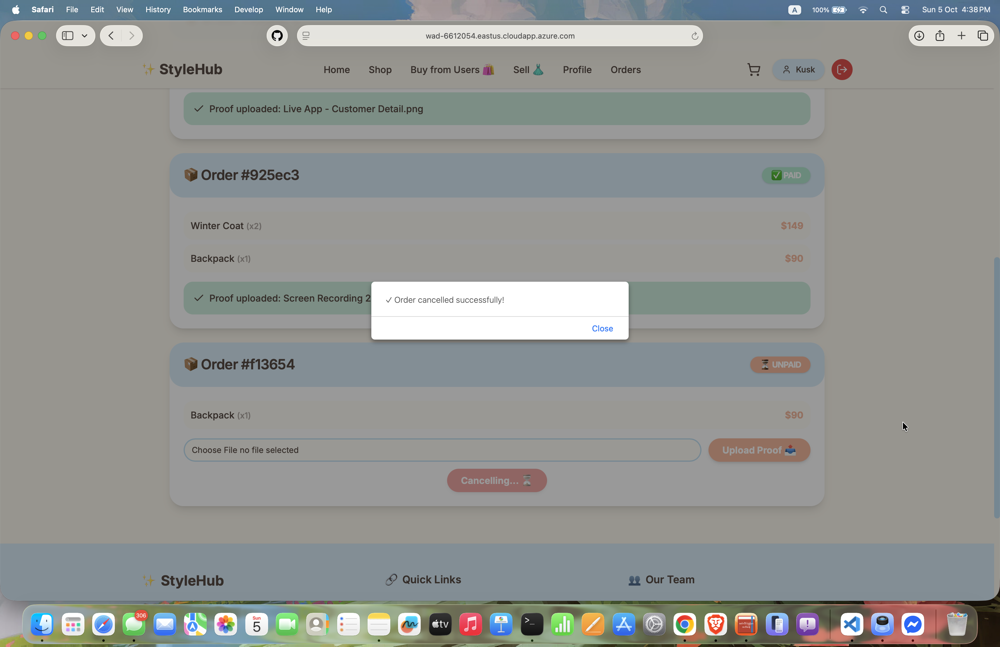

# 👗 StyleHub - Fashion E-Commerce Platform

A modern, full-stack clothing e-commerce platform with peer-to-peer marketplace functionality. Built with Next.js, MongoDB, and featuring complete **CRUD** operations for three core data models.

## 👥 Team Members

- **Win Yu Maung** - [GitHub Profile](https://github.com/Kusk24)
- **Sam Yati** - [GitHub Profile](https://github.com/narattscoward)
- **Phonvan Deelertpattana** - [GitHub Profile](https://github.com/IamPailin)

## 🎥 Demo Video

Watch our project demo: [YouTube Link](https://youtube.com/placeholder)

## 🚀 Live Deployment

**Azure Web App**: [https://wad-6612054.eastus.cloudapp.azure.com/app/project02](https://wad-6612054.eastus.cloudapp.azure.com/app/project02)

## 📝 Project Description

StyleHub is a comprehensive e-commerce platform that allows users to:
- Browse and purchase clothing items from the official shop
- Create accounts and manage their profiles
- List and sell their own clothing items in a peer-to-peer marketplace
- Place orders with payment proof upload functionality
- Track order history and manage listings
- Cancel unpaid orders (which automatically reactivates sold listings)

The platform features a kawaii-inspired design with pastel colors, smooth animations, and an intuitive user interface.

## 🏗️ Tech Stack

### Frontend
- **Framework**: Next.js 15 (App Router)
- **UI Library**: React 19
- **Styling**: Tailwind CSS 4, Custom CSS Variables
- **Components**: shadcn/ui (Card, Button, Input, Select, Badge)
- **Icons**: Lucide React
- **State Management**: React Context API (AuthContext, CartContext)

### Backend
- **Runtime**: Node.js
- **Database**: MongoDB with Mongoose ODM
- **Authentication**: JWT (JSON Web Tokens) with HTTP-only cookies
- **Password Security**: bcrypt for hashing
- **API**: RESTful API with Next.js Route Handlers

### Deployment
- **Platform**: Azure
- **Database**: MongoDB Atlas

## � Data Models (CRUD Operations)

### 1. **User Model** 👤
Complete user authentication and profile management system.

**Fields:**
- `name`, `email`, `password`, `phone`, `address`
- Auto-generated: `createdAt`

**CRUD Operations:**
- ✅ **C**reate - User registration (`POST /api/auth/register`)
- ✅ **R**ead - Get user session (`GET /api/auth/session`)
- ✅ **U**pdate - Update profile with password verification (`PATCH /api/users`)
- ✅ **D**elete - Delete account (`DELETE /api/users`)

**Additional Features:**
- JWT-based authentication
- Password change with current password verification
- Secure logout with cookie clearing

### 2. **Cloth Model** 👕
Dual-purpose model for both shop inventory and user marketplace listings.

**Fields:**
- Basic: `name`, `price`, `originalPrice`, `description`, `image`, `category`, `sizes[]`
- Shop: `sale`, `rating`, `reviews`, `inStock`
- User Listings: `user`, `userName`, `userEmail`, `condition`, `brand`, `status`, `views`
- Timestamps: `createdAt`, `updatedAt`

**CRUD Operations:**
- ✅ **C**reate - Add shop items or user listings (`POST /api/clothes`)
- ✅ **R**ead - Get all clothes with filters (`GET /api/clothes?marketplace=true&userId=xxx`)
- ✅ **U**pdate - Edit listing details and status (`PATCH /api/clothes/[id]`)
- ✅ **D**elete - Remove listings with ownership verification (`DELETE /api/clothes/[id]`)

**Smart Features:**
- `user: null` → Shop item (official store)
- `user: ObjectId` → User listing (P2P marketplace)
- Status management: `active`, `sold`, `unlisted`
- View counter increment on each view
- Automatic status change to `sold` when purchased
- Reactivation to `active` when order is cancelled

### 3. **Sale (Order) Model** 🛒
Complete order management with payment tracking.

**Fields:**
- `user` (reference to User)
- `userInfo` (name, email, phone, address)
- `items[]` (cart items with details)
- `total`, `status`, `paymentProof`
- `deliveryEstimate`, `cancellationDeadline`
- Timestamps: `createdAt`

**CRUD Operations:**
- ✅ **C**reate - Place new order (`POST /api/orders`)
- ✅ **R**ead - Get user's order history (`GET /api/orders?email=xxx`)
- ✅ **U**pdate - Update payment status (`PATCH /api/orders/[id]`)
- ✅ **D**elete - Cancel unpaid orders (`DELETE /api/orders/[id]`)

**Advanced Features:**
- Payment proof upload (now or later)
- Order status: `paid`, `unpaid`, `pending`
- 24-hour cancellation deadline for unpaid orders
- Automatic reactivation of user listings on cancellation

## 📝 API Endpoints

### Authentication
- `POST /api/auth/register` - Register new user
- `POST /api/auth/login` - User login
- `POST /api/auth/logout` - User logout
- `GET /api/auth/session` - Get current user session

### Users
- `PATCH /api/users` - Update user profile
- `DELETE /api/users` - Delete user account

### Clothes
- `GET /api/clothes` - Get all clothes (with filters)
- `POST /api/clothes` - Create new listing
- `GET /api/clothes/[id]` - Get single cloth
- `PATCH /api/clothes/[id]` - Update cloth
- `DELETE /api/clothes/[id]` - Delete cloth

### Orders
- `GET /api/orders` - Get user's orders
- `POST /api/orders` - Create new order
- `GET /api/orders/[id]` - Get single order
- `PATCH /api/orders/[id]` - Update order status
- `DELETE /api/orders/[id]` - Cancel order

## 📸 Screenshots

### User **CRUD** Operations

*User registration with validation*


*User profile display*


*Profile editing with password change*


*Account deletion confirmation*

### Cloth **CRUD** Operations

*Create new clothing listing*


*View all clothing items*


*Edit listing details and status*


*Delete listing confirmation*

### Order **CRUD** Operations

*Place new order with payment*


*View order history*


*Update order payment status*


*Cancel unpaid order*

## 🚀 Features

### Authentication & Authorization
- Secure JWT-based authentication
- HTTP-only cookies for token storage
- Password hashing with bcrypt
- Protected routes with middleware
- Role-based access (users can only edit/delete their own listings)

### E-Commerce Functionality
- **Shop**: Browse official store items
- **Marketplace**: Buy from other users
- **Sell**: List your own clothing items
- **Cart**: Add items, adjust quantities, remove items
- **Checkout**: Multi-step checkout with payment proof upload
- **Order History**: Track all orders with status updates

### Peer-to-Peer Marketplace
- Users can list their own clothing items
- Edit, publish/unlist, and delete own listings
- View counter for each listing
- Condition tags (New, Like New, Good, Fair)
- Automatic status management (active → sold → active on cancellation)
- Ownership verification prevents self-purchase

### Smart Business Logic
- **Order Placement**: User listings automatically marked as `sold`
- **Order Cancellation**: Sold items reactivate and return to marketplace
- **Sold Item Management**: Cannot be deleted or edited, only unlisted
- **Payment Options**: Upload now (immediate) or later (24-hour deadline)

## 🎨 Design Features

- **Kawaii Theme**: Pastel colors (cream, cloud blue, coral, mint, lavender)
- **Smooth Animations**: Hover effects, scale transforms, floating animations
- **Responsive Design**: Mobile-first approach with Tailwind CSS
- **Intuitive UI**: Clear navigation, status badges, emoji indicators
- **Loading States**: Beautiful loading animations

## 📁 Project Structure

```
project02-web-app-development/
├── app/
│   ├── api/
│   │   ├── auth/          # Authentication routes
│   │   ├── clothes/       # Cloth **CRUD** operations
│   │   ├── orders/        # Order **CRUD** operations
│   │   └── users/         # User **CRUD** operations
│   ├── cart/              # Shopping cart page
│   ├── history/           # Order history page
│   ├── login/             # Login page
│   ├── marketplace/       # User listings marketplace
│   ├── profile/           # User profile page
│   ├── register/          # Registration page
│   ├── sell/              # User listing management
│   └── shop/              # Shop page
├── components/            # Reusable React components
├── context/               # React Context (Auth, Cart)
├── lib/                   # Utilities and database connection
├── models/                # Mongoose schemas
├── public/                # Static assets
└── screenshots/           # Project screenshots
```

## 🛠️ Getting Started

### Prerequisites
- Node.js 18+ and pnpm
- MongoDB Atlas account or local MongoDB

### Installation

1. **Clone the repository**
   ```bash
   git clone https://github.com/Kusk24/Project02-Web-App-Development.git
   cd Project02-Web-App-Development
   ```

2. **Install dependencies**
   ```bash
   pnpm install
   ```

3. **Set up environment variables**
   Create a `.env.local` file:
   ```env
   MONGODB_URI=your_mongodb_connection_string
   JWT_SECRET=your_jwt_secret_key
   NEXT_PUBLIC_API_URL=http://localhost:3000
   ```

4. **Run development server**
   ```bash
   pnpm dev
   ```

5. **Open browser**
   Navigate to [http://localhost:3000](http://localhost:3000)

## 🔒 Security Features

- JWT tokens stored in HTTP-only cookies
- Password hashing with bcrypt (10 salt rounds)
- CSRF protection with SameSite cookies
- Protected API routes with middleware
- Ownership verification for user operations
- Input validation and sanitization

---

**Final Project Submission**  
**Course**: Web Application Development  
**Project Duration**: 20 hours per team member  